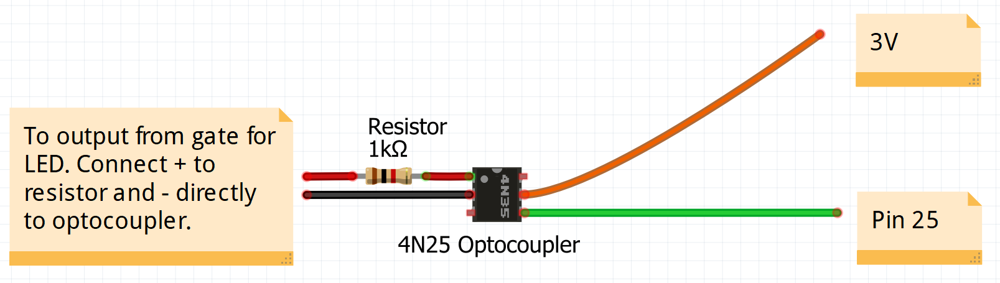

# Crossley Gate Interpreter

This script monitors the input from an optocoupler connected to the LED output of a Centurion D5 (2008) gate motor and sends a notification is the status changes.

In more detail, this script:
- Reads the status of the LED every tenth of a second (i.e. every 0.1 seconds), incrementing a count if the LED is illuminated
- Interprets the length of time that the LED has been illuminated every 5 seconds
- Correlates the length of time that the LED has been illuminated against an array of statuses
- Sends a notification through Pushover if warranted by the current status

This script is written in **MicroPython** for an **ESP32 Microcontroller**.

## Prerequisites
The following hardware is required:
- ESP32 development board
- 4N25 optocoupler connected to 3V and Pin 25 
- Centurion D5 gate motor with *STATUS* LED connected to optocoupler with 1kΩ resistor on positive

Connect the gate as below.

You'll need a license for [Pushover](https://pushover.net/).

Before flashing the ESP32, you'll need to create a `config.py` file and provide WiFi and Pushover credentials.

To flash this script to the ESP32, you'll need (and have experience using):
- [Esptool.py](https://github.com/espressif/esptool) by Espressif
- [Visual Studio Code](https://code.visualstudio.com/) with [PyMakr](https://forum.pycom.io/topic/7574/pymakr-2-for-visual-studio-code) extension

### Pymakr

The Visual Studio Code Workspace `crossley-gate.code-workspace` file is saved in the root directory. `pymakr.conf` is saved in the `crossley-gate` directory.

## LED statuses

The interpreter monitors for activity on the *STATUS* LED as detailed by the [Centurion D5 installation manual](https://www.centsys.co.za/upload/0_07_A_0115_%20D3D5%20installation%20manual%2022072013-BM-for%20web.pdf).

|LED				 	|Status				|Notification message						|Notification repeats
|-----------------------|-------------------|-------------------------------------------|------------
| Off					| Gate is closed	|No notification							|Never
| Slow continuous flash	| Gate is opening	|No notification							|Never
| On					| Gate is open		|Gate OPEN									|Every 5 minutes
| 2 flashes/second		| No mains			|Gate has an AC power or battery failure	|Every 30 minutes
| 3 flashes/second		| Battery low		|Gate has an AC power or battery failure	|Every 30 minutes

Whether or not a notification should be sent, and whether the notification should be repeated, is customisable in the script.

## Troubleshooting
The ESP32 will provide some indication as to its current status as follows:
- When connecting to WiFi, shortly after power is connected, the ESP32 will flash four times in quick succession. If the connection is successful, a further two flashes will follow soon after.
- Following connection to WiFi, the ESP32 will flash to match the state of the gate *STATUS* LED (as outlined under LED Statuses, above). This indicates that the ESP32 is correctly monitoring the LED.
- If the gate status changes and a notification is sent, the ESP32 will flash three times in quick succession.
